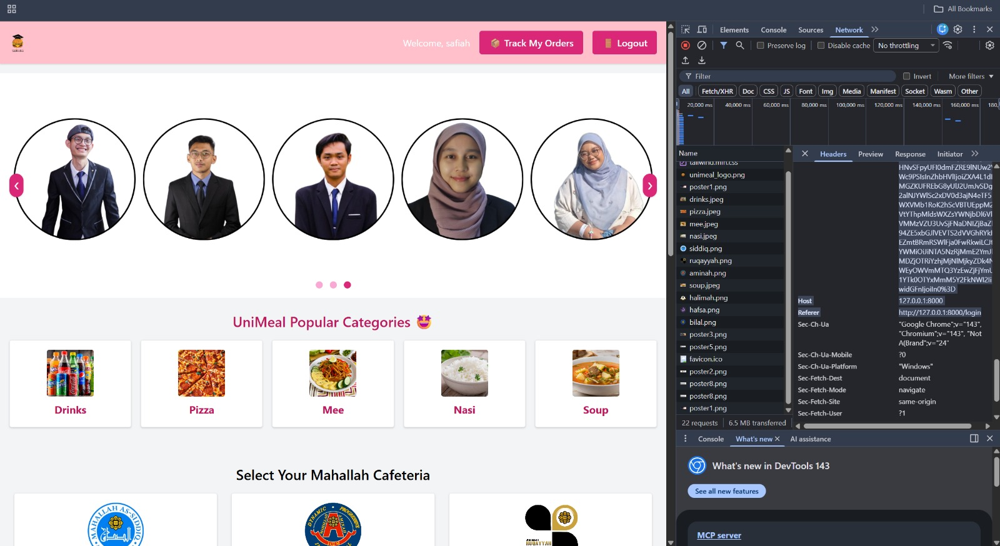
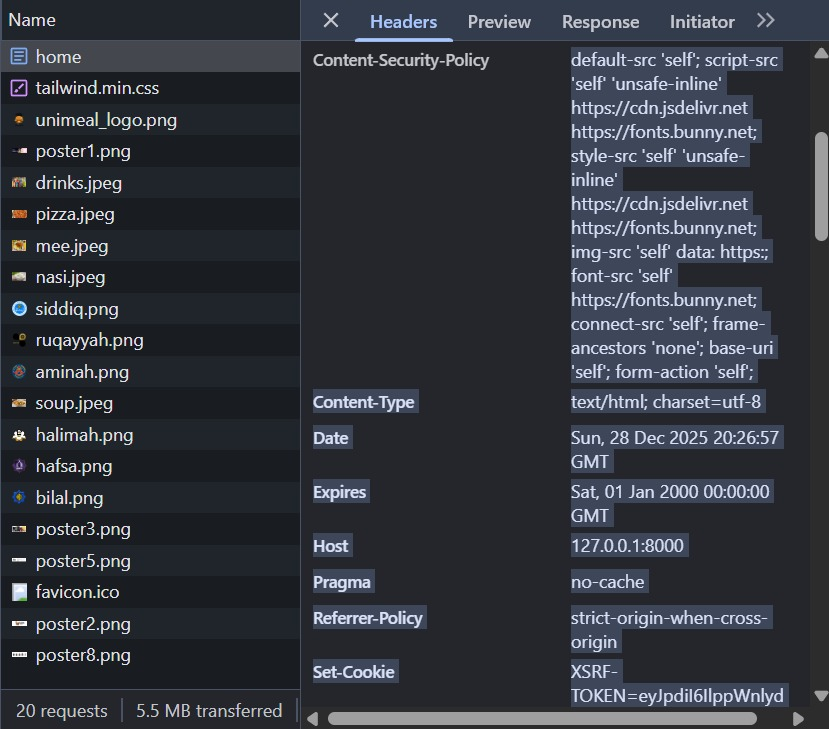
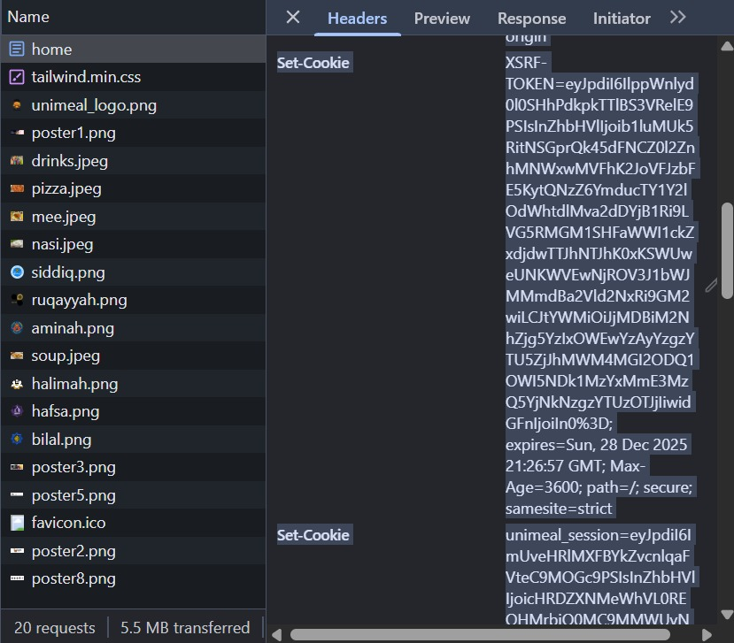
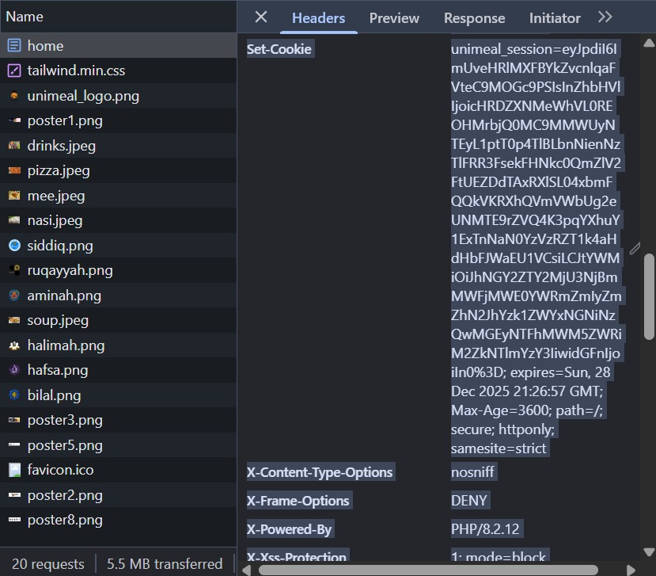
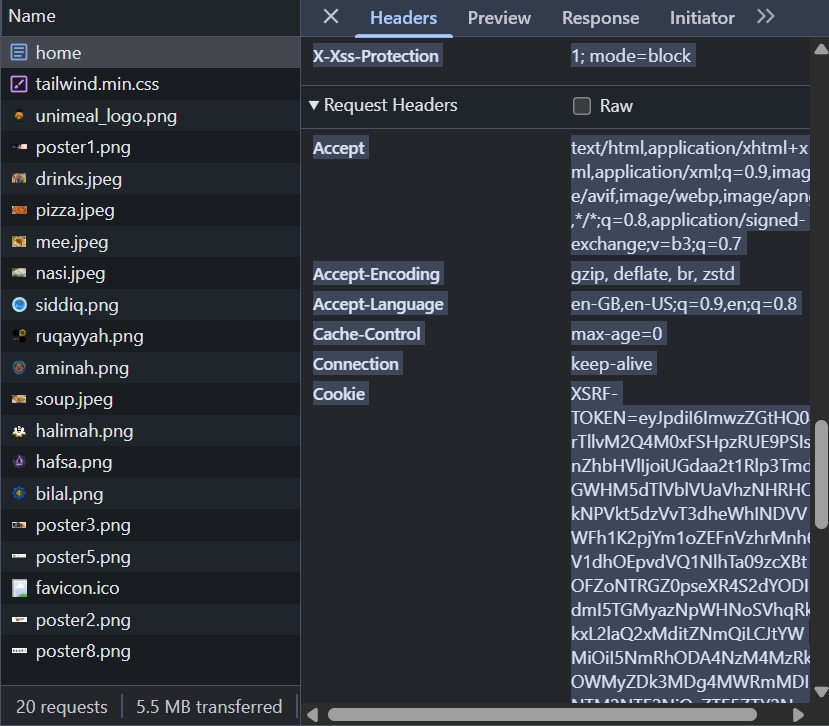
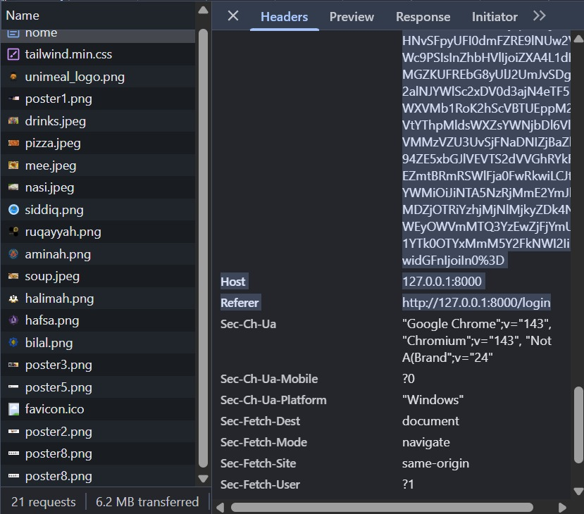

# Title: UNIMEAL
## GROUP MEMBERS:
1. __NUR SAFIAH ASHIQIN BINTI SHUHANIZAL__ and __2317618__
2. __NURAIN IZZATI BINTI ABD RAUF__ and __2217978__
3. __NURSYAZIRA BINTI MOHD NAIM__ and __2214076__
4. __NUR RAIHAN SYAZWANI BINTI SUHAIMI__ and __2213262__

## 1.0 Introduction

Food service is one of the important criteria for having a comfortable life as a university student. Throughout the time, the increasing number of students in IIUM had addressed the new problem of the efficiency and services of cafeteria food on the campus. Therefore, UniMeal is introduced to solve this problem. A redesigned web application called UniMeal gathers student orders for food and displays the menus from several cafeterias around IIUM. The main target audience of this web application is IIUM students and also the Mahallah Cafeteria. Students will have better food services to buy food, and the Mahallah Cafeteria will also get the benefit of having a lot of online orders. UniMeal's main goal is to give students access to online apps that will enhance the effectiveness of food services at IIUM in the future.


## 2.0 Objectives
The primary objective of the UniMeal's security enhancement is:
1. To improve input handling and validation
2. To strengthen authentication mechanisms
3. To enforce proper authorization and access control
4. To prevent client-side and server-side attacks such as XSS and CSRF
5. To secure database interactions and prevent SQL injection
6. To enhance file security and prevent unauthorized file access or leakage
7. To align the web application with industry best practices for web application security.


## 3.0 Features and Functionalities
The UniMeal web application aims to deliver an efficient, user-friendly, and centralized platform for food ordering across IIUM campus cafeterias. The key features and functionalities are as follows:

1. User Registration and Login
   - Secure user authentication system for students and cafeteria vendors.
   - User roles: Student (customer) and Vendor (cafeteria admin).

2. Cafeteria and Menu Browsing
   - Browse and view a list of all available cafeterias within the IIUM campus.
   - Access to daily menus, prices, food images, and descriptions.

3. Food Ordering System
   - Add items to the cart and place food orders directly from the selected cafeteria.
   - Real-time availability and estimated preparation time display.

4. Payment Integration
   - Multiple payment options: cash on pickup, online banking, or e-wallet integration.
   - Order receipt generation for records.

5. Order Tracking
   - Live status updates: Order placed → Preparing → Ready for pickup..

6) Cafeteria Dashboard (Vendor Panel)
   - Cafeteria vendors can manage their menus and receive orders.

7) Responsive Design
   - Optimised for desktop for easy access on a laptop.
  
## Web Application Security Enhancements
## i. Input Validation
Input validation is the first line of defense against various web application attacks including SQL injection, XSS, command injection, and business logic exploitation. Both client-side and server-side validation were implemented across all user input points to ensure data integrity and security.

__1. Registation Form Validation__

Implemented Security Controls:

__Client-Side Validation (register_student.blade.php):__

- Real-time password strength checking using JavaScript
- Password confirmation matching before form submission
- Immediate user feedback on validation errors


__Server-Side Validation (StudentAuthController):__
- Matric Number: Integer type, must be unique in database
- Name: String, maximum 255 characters, regex pattern to prevent HTML tags (/^[^<>]*$/)
- Email: Valid email format, must be unique in database
- Password:
   - Minimum 10 characters
   - Must contain at least one lowercase letter
   - Must contain at least one uppercase letter
   - Must contain at least one digit
   - Must contain at least one special character (@$!%*?&#)
   - Regex pattern: /^(?=.*[a-z])(?=.*[A-Z])(?=.*\d)(?=.*[@$!%*?&#])[A-Za-z\d@$!%*?&#]+$/
- Password Confirmation: Must match password field

Code Snippet:

```
public function register(Request $request)
{
    $request->validate([
        'matric_no' => 'required|integer|unique:students,matric_no',
        'name' => 'required|string|max:255|regex:/^[^<>]*$/',
        'email' => 'required|email|unique:students,email',
        'password' => [
            'required',
            'string',
            'min:10',
            'confirmed',
            'regex:/^(?=.*[a-z])(?=.*[A-Z])(?=.*\d)(?=.*[@$!%*?&#])[A-Za-z\d@$!%*?&#]+$/'
        ],
    ]);
}
```


__Client-Side JavaScript Validation:__

```
document.querySelector('form').addEventListener('submit', function(e) {
    const password = document.querySelector('input[name="password"]').value;
    const confirm = document.querySelector('input[name="password_confirmation"]').value;

    const regex = /^(?=.*[a-z])(?=.*[A-Z])(?=.*\d)(?=.*[@$!%*?&#])[A-Za-z\d@$!%*?&#]{10,}$/;

    if (!regex.test(password)) {
        e.preventDefault();
        alert('Password must be at least 10 characters with uppercase, lowercase, number, and special character.');
        return false;
    }

    if (password !== confirm) {
        e.preventDefault();
        alert('Passwords do not match!');
        return false;
    }
});
```


__2. Login Form Validation__

The login endpoint (/login) handles authentication credentials and must validate input to prevent injection attacks and ensure proper data types.


Implemented Security Controls:
- Email: Required, must be valid email format
- Password: Required, must be string type

Code Snippet:
```
   public function login(Request $request)
{
    $request->validate([
        'email' => 'required|email',
        'password' => 'required|string',
    ]);
}
```


__3. Cart Input Validation__

The cart functionality handles product data that could be manipulated to exploit pricing or inject malicious content.


__Add to Cart Validation (CartController::add)__

Implemented Security Controls:

- Product Name: Required, string, maximum 255 characters
- Price: Required, numeric, minimum 0, maximum 9999.99
- Image Path: Required, string, maximum 500 characters
- Price Sanitization: Uses floatval() with regex to strip non-numeric characters

Code Snippet:

```
   public function add(Request $request)
   {
      $validated = $request->validate([
         'name' => 'required|string|max:255',
         'price' => 'required|numeric|min:0|max:9999.99',
         'image' => 'required|string|max:500',
      ]);

      // Convert price to float safely
      $price = floatval(preg_replace('/[^0-9.]/', '', $request->price));

      $cart[] = [
         'name' => $validated['name'],
         'price' => $validated['price'],
         'image' => $validated['image'],
         'quantity' => 1,
      ];
   }
```


__Update Cart Quantity Validation (CartController::update)__

Implemented Security Controls:

- Action Parameter: Required, string, must be either "increase" or "decrease"
- Index Parameter: Type-cast to integer, must be non-negative and within cart bounds

Code Snippet:
```
      public function update(Request $request, $index)
   {
      // Validate action parameter
      $validated = $request->validate([
         'action' => 'required|string|in:increase,decrease',
      ]);

      // Validate and type-cast index
      $index = (int) $index;

      if ($index < 0) {
         abort(400);
      }

      $cart = Session::get('cart', []);

      if (!isset($cart[$index])) {
         abort(404);
      }

      // Use validated action
      if ($validated['action'] === 'increase') {
         $cart[$index]['quantity'] += 1;
      } elseif ($validated['action'] === 'decrease' && $cart[$index]['quantity'] > 1) {
         $cart[$index]['quantity'] -= 1;
      }
   }
```


__Remove Cart Item Validation (CartController::remove)__

Implemented Security Controls:

- Index Bounds Checking: Validates index is within valid range before removal
- Type Casting: Converts index to integer to prevent type juggling attacks

Code Snippet:

```
   public function remove($index)
{
    $index = (int) $index;
    $cart = Session::get('cart', []);
    
    // Add bounds checking
    if ($index < 0 || $index >= count($cart)) {
        abort(404, 'Invalid cart item');
    }

    if (!isset($cart[$index])) {
        abort(404, 'Cart item not found');
    }
    
    unset($cart[$index]);
}
```


__4. Checkout Form Validation__

The checkout process handles sensitive shipping and payment information requiring comprehensive validation.


__Shipping Information Validation (CheckoutController::process)__
Implemented Security Controls:

Name:
- Required, string, maximum 255 characters
- Regex pattern to allow only letters and spaces: /^[a-zA-Z\s]+$/


Phone Number:
- Required, string
- Regex pattern for Malaysian phone format: /^(\+?6?01)[0-46-9]-*[0-9]{7,8}$/
- Custom error message for user guidance


Address:
- Required, string, maximum 500 characters
- Regex pattern to prevent HTML tags: /^[^<>]*$/


Cart Quantities:
- Required, integer
- Minimum 1, maximum 100 per item

Code Snippet

```
public function process(Request $request)
{
    $validated = $request->validate([
        'name' => [
            'required',
            'string',
            'max:255',
            'regex:/^[a-zA-Z\s]+$/',
        ],
        'phone' => [
            'required',
            'string',
            'regex:/^(\+?6?01)[0-46-9]-*[0-9]{7,8}$/',
        ],
        'address' => 'required|string|max:500|regex:/^[^<>]*$/',
        'cart.*.quantity' => 'required|integer|min:1|max:100',
    ], [
        'phone.regex' => 'Please make sure the phone number is in Malaysian Phone Format (e.g., 012-3456789 or +6012-3456789).',
    ]);
}
```


__Delivery Option Validation (CheckoutController::processDelivery)__

Implemented Security Controls:

- Delivery Option: Required, string, must be one of: "Pick Up", "15 - 20 Minutes", "Now"
- Server-Side Fee Calculation: Delivery fee calculated server-side instead of trusting client input

Code Snippet:
```
   public function processDelivery(Request $request)
{
    $validated = $request->validate([
        'delivery_option' => 'required|string|in:Pick Up,15 - 20 Minutes,Now',
    ]);

    // Calculate fee server-side based on option - don't trust client
    $deliveryFees = [
        'Pick Up' => 0.00,
        '15 - 20 Minutes' => 3.00,
        'Now' => 5.00,
    ];

    $deliveryFee = $deliveryFees[$validated['delivery_option']];
    Session::put('shipping_fee', $deliveryFee);
}
```


__Payment Method Validation (CheckoutController::processPayment)__

Implemented Security Controls:

- Payment Method: Required, string, must be one of: "cash", "credit_card", "bank_transfer", "other"
- Server-Side Total Recalculation: All monetary values recalculated server-side
- Cart Item Validation:
   - Validates item structure (price, quantity, name fields exist)
   - Validates positive prices and quantities
   - Enforces maximum quantity of 100 per item
   - Validates reasonable total (between 0 and 10,000)

Code Snippet:

```
public function processPayment(Request $request)
{
    // Validate payment method only - don't accept amounts from client
    $validated = $request->validate([
        'payment_method' => 'required|string|in:cash,credit_card,bank_transfer,other',
    ]);

    // Recalculate everything server-side
    $deliveryFees = [
        'Pick Up' => 0.00,
        '15 - 20 Minutes' => 3.00,
        'Now' => 5.00,
    ];

    $deliveryOption = Session::get('delivery_option');
    
    if (!array_key_exists($deliveryOption, $deliveryFees)) {
        Log::error('Invalid delivery option in payment', [
            'user' => $user->matric_no,
            'option' => $deliveryOption
        ]);
        return redirect()->route('checkout.delivery')->with('error', 'Invalid delivery option.');
    }

    $shippingFee = $deliveryFees[$deliveryOption];
    
    // Recalculate cart totals and validate items
    $subtotal = 0;
    foreach ($cart as $item) {
        // Validate each item structure
        if (!isset($item['price']) || !isset($item['quantity']) || !isset($item['name'])) {
            Log::error('Invalid cart item structure', [
                'user' => $user->matric_no,
                'item' => $item
            ]);
            return redirect()->route('cart.show')->with('error', 'Invalid cart data.');
        }
        
        // Validate positive numbers
        if ($item['price'] <= 0 || $item['quantity'] < 1) {
            Log::error('Invalid cart item values', [
                'user' => $user->matric_no,
                'item' => $item
            ]);
            return redirect()->route('cart.show')->with('error', 'Invalid item prices or quantities.');
        }

        // Validate reasonable quantity
        if ($item['quantity'] > 100) {
            Log::warning('Excessive quantity in cart', [
                'user' => $user->matric_no,
                'item' => $item
            ]);
            return redirect()->route('cart.show')->with('error', 'Quantity per item cannot exceed 100.');
        }
        
        $subtotal += $item['price'] * $item['quantity'];
    }

    // Calculate tax and total
    $salesTax = round($subtotal * 0.065, 2);
    $orderTotal = round($subtotal + $salesTax + $shippingFee, 2);

    // Validate amounts are reasonable
    if ($orderTotal <= 0 || $orderTotal > 10000) {
        Log::error('Suspicious order total', [
            'user' => $user->matric_no,
            'total' => $orderTotal
        ]);
        return redirect()->route('cart.show')->with('error', 'Order total is invalid.');
    }

    // Create order with validated, server-calculated values
    Order::create([
        'student_id' => $user->matric_no,
        'total_amount' => $orderTotal, // Server-calculated
        'payment_method' => $validated['payment_method'],
        'shipping_fee' => $shippingFee, // Server-calculated
        'sales_tax' => $salesTax, // Server-calculated
        // ... other fields
    ]);
}
```


__5. Mahallah Selection Validation__

The mahallah (cafeteria) selection endpoint accepts user input that determines which menu to display and must be validated to prevent path traversal and injection attacks.
5.1 Mahallah Name Whitelist Validation

Implemented Security Controls:

- Whitelist Validation: Only accepts predefined mahallah names
- Case-Insensitive Matching: Converts to lowercase before validation
- 404 Response: Returns 404 for invalid mahallah names instead of exposing error details

Code Snippets:
```
public function show(Request $request, $mahallah)
{
    // Whitelist validation
    $allowed = ['siddiq', 'aminah', 'ruqayyah', 'halimah', 'hafsa', 'bilal'];

    if (!in_array(strtolower($mahallah), $allowed)) {
        abort(404);
    }
    
    // Safe to use after validation
    return view('student.food', [
        'mahallah' => ucfirst($mahallah),
        'logo' => strtolower($mahallah) . '.png',
    ]);
}
```


__Search Parameter Validation__

Implemented Security Controls:

- Nullable: Search is optional
- String Type: Must be string
- Maximum Length: 50 characters to prevent DoS
- Alpha-Dash: Only allows letters, numbers, dashes, and underscores
- XSS Prevention: Uses strip_tags() to remove any HTML/script tags

```
// Add validation
$validated = $request->validate([
    'search' => 'nullable|string|max:50|alpha_dash',
]);

$search = $validated['search'] ?? null;

if ($search) {
    // Sanitize for XSS prevention
    $search = strip_tags($search);

    $menus = collect($menus)->filter(function ($item) use ($search) {
        return str_contains(strtolower($item['category']), strtolower($search));
    })->values()->all();
}
```


__6. Order Tracking Validation__

The order tracking endpoint accepts order IDs that must be validated to prevent unauthorized access and type juggling attacks.

Implemented Security Controls:

- Type Casting: Converts ID to integer to prevent type juggling
- Positive Number Validation: Ensures ID is greater than 0
- 404 Response: Returns 404 for invalid IDs

Code Snippet:

```
   public function track($id)
{
    // Add type cast and validate
    $id = (int) $id;

    if ($id <= 0) {
        abort(404);
    }

    $order = Order::with(['orderItems', 'shipping'])->findOrFail($id);
    
    return view('orders.track', compact('order'));
}
```


__Similarly for Receipt Viewing (CheckoutController::receipt)__

```
public function receipt($orderId)
{
    // Type cast and validate ID
    $orderId = (int) $orderId;

    if ($orderId <= 0) {
        abort(404);
    }

    $order = Order::with('orderItems', 'shipping')->findOrFail($orderId);
    
    return view('checkout.receipt', compact('order'));
}
```


## ii. Authentication
__1. Stronger Password Policies__

Student registration (/register/student) and authentication (/login) endpoints were identified as critical entry points where weak credentials could expose the system to brute force and credential stuffing attacks.

Implemented Security Controls:
- Minimum password length increased to 10 characters
- Enforced uppercase and lowercase letters
- Required numeric characters
- Required special symbols
- Enabled compromised password checks using the Have I Been Pwned database
- Uses k-anonymity (only partial hash shared)
- Prevents reuse of known breached passwords


Code Snippet:

Password::defaults(function () {
    return Password::min(10)
        ->letters()
        ->mixedCase()
        ->numbers()
        ->symbols()
        ->uncompromised();
});

__2. Login Attempt Monitoring__

Although SQL injection attempts on the login form were unsuccessful due to input validation and prepared statements, repeated authentication attempts could still indicate brute force or automated attacks.

Implemented Security Controls:
- Logs akk login attempts (successful and failed)
- Automatically removes failed attempts after a successful login


__3. Account Lockout Mechanism__

Repeated failed authentication attempts can lead to password guessing attacks even when SQL injection is mitigated.

Lockout Policy
- Maximum 5 failed login attempts
- Lockout duration: 15 minutes
- Reset after successful login or timeout expiry


__4. Session Security Hardening__

Production testing highlighted the need to prevent session fixation, hijacking, and CSRF attacks after successful authentication.

Environment Configuration

SESSION_DRIVER=database

SESSION_LIFETIME=60

SESSION_SECURE_COOKIE=true

SESSION_HTTP_ONLY=true

SESSION_SAME_SITE=strict


### iii. Authorization
__1. Order Authorization Policy__

During authorization testing, an attempt was made for Student B to access Student A’s order by directly modifying the URL (/orders/track/{id}).
Without proper authorization checks, this would constitute an IDOR vulnerability.

Authorization Controls Implemented
- Students can only view orders that belong to them
- Order receipts are protected using the same ownership rule

Security Impact
- Prevents unauthorized order access via URL manipulation
- Mitigates IDOR attacks
- Ensures consistent authroization across controllers
- Replaces manual authorization checks with centralized policy enforcement


__2. Time-Based Order Restrictions (Attribute-Based Authorization)__

Business logic testing identified that orders could be placed at any time, including periods when cafeteria operations should be closed.
This presents a business logic abuse risk, not a technical exploit.

Authorization Controls Implemented
- Orders are only allowed during defined operating hours

Security Impact
- Prevents unauthroized order placement outside business rules
- Mitigates abuse of checkout logic


## iv. XSS and CSRF Prevention

This section describes the security measures implemented to protect the UniMeal Laravel application against Cross-Site Scripting (XSS) and Cross-Site Request Forgery (CSRF) attacks. The measures cover all relevant pages and forms, including authentication, checkout, and dashboards. The implementation uses a combination of browser-level, application-level, and framework-level protections.

__1. Content Security Policy (CSP) Middleware__

__Purpose:__

CSP prevents XSS attacks by controlling which resources (scripts, styles, images, etc.) the browser can load and execute. It acts as a “whitelist” for allowed resources, blocking malicious scripts even if they are injected.

__Implementation Details:__

-Created middleware ContentSecurityPolicy.php.

-Registered middleware in app.php to apply to all web routes.

-Added HTTP headers including Content-Security-Policy, X-Content-Type-Options, X-Frame-Options, X-XSS-Protection, and Referrer-Policy.

__Key CSP Rules:__

-default-src 'self' → Only load resources from the same domain.

-script-src 'self' 'unsafe-inline' https://cdn.jsdelivr.net https://fonts.bunny.net → Allow scripts from site and specific CDNs.

-style-src 'self' 'unsafe-inline' https://cdn.jsdelivr.net https://fonts.bunny.net → Allow styles from site and CDNs.

-img-src 'self' data: https: → Allow images from the site, data URIs, and HTTPS sources.

-frame-ancestors 'none' → Prevent clickjacking.

-form-action 'self' → Only allow form submissions to the same domain.

__Security Benefits:__

-Blocks XSS script execution.

-Prevents clickjacking.

-Stops unauthorized AJAX requests.

-Adds an extra layer of defense in depth.


__2. Input Validation Against HTML Injection__

__Purpose:__

Even with CSP, users could inject harmful HTML that affects layout or causes stored XSS. Server-side validation ensures only clean data is stored.

__Implementation Details:__

-Added regex validation (regex:/^[^<>]*$/) to disallow < and > in sensitive fields (e.g., name, address).

A-pplied in StudentAuthController.php (registration) and CheckoutController.php (checkout forms).

$request->validate([
    'name' => 'required|string|max:255|regex:/^[^<>]*$/',
    'address' => 'required|string|max:500|regex:/^[^<>]*$/',
]);

__Security Benefits:__

-Prevents stored XSS attacks.

-Ensures data integrity.

-Complements CSP for defense in depth.


__3. CSRF Token Verification__

__Purpose:__

CSRF attacks trick users into performing actions without their consent. Laravel’s built-in CSRF protection prevents this.

__Implementation Details:__

-Verified all forms include @csrf for hidden tokens.

-AJAX requests use <meta name="csrf-token" content="{{ csrf_token() }}">.

-Laravel validates tokens automatically on state-changing requests (POST, PUT, DELETE).

__Security Benefits:__

-Blocks unauthorized form submissions.

-Tokens are session-specific and expire on logout.

-No manual code needed; framework handles validation.









Initial Security Audit and Vulnerability Identification

## V. Database Security Principles

This section describes the database-level security mechanisms implemented in the UniMeal web application. These controls protect the system even if application-level validation or authentication mechanisms are bypassed. The focus is on preventing SQL injection, enforcing data integrity, limiting database privileges, and ensuring secure error handling.

---

### 1. SQL Injection Prevention Using Prepared Statements

**Security Principle:** Parameterized Queries 
**Technology:** Laravel Eloquent ORM

All database interactions in UniMeal are performed using Laravel’s Eloquent ORM, which automatically utilizes prepared statements. User inputs are never directly concatenated into SQL queries.

**Code snippet:**
```
php
$student = Student::where('email',   $request->email)->first();
```

Security Impact:

- Prevents SQL injection attacks (e.g., ' OR '1'='1')

- Treats all user input as data, not executable SQL

- Effective even if input validation is bypassed

Testing Performed:

Authentication bypass attempts using SQL payloads

- SQL comment injection (' --)

- Single-quote injection (')

Result: All injection attempts were safely rejected.


This uses Laravel Eloquent ORM which internally creates a prepared statement:

```
$pdo->prepare("SELECT * FROM students WHERE email = ?");
$pdo->execute([$request->email]);
```

The injection payload is treated as literal data, not SQL code.


2. Mass Assignment Protection

- Security Principle: Least Privilege, Data Integrity

- Location: Eloquent Models

Sensitive database models explicitly define writable attributes using the $fillable property to prevent unauthorized field manipulation.

**Code snippet:**
```
class Order extends Model
{
    protected $fillable = [
        'student_id',
        'total_amount',
        'payment_method',
        'shipping_fee',
        'sales_tax'
    ];
}
```

Security Impact:

Prevents attackers from modifying protected fields (e.g., status, is_admin)
Blocks privilege escalation via crafted requests

Testing Performed:

Attempted to inject non-fillable fields using modified POST requests


Result: Unauthorized fields were ignored and not stored.


3. Referential Integrity via Foreign Key Constraints

- Security Principle: Referential Integrity

- Layer: Database Schema

Foreign key constraints are used to enforce valid relationships between database tables.

```
$table->foreign('student_id')
      ->references('matric_no')
      ->on('students')
      ->onDelete('cascade');
```

Security Impact:

- Prevents orphaned records
- Ensures orders are always linked to valid students
- Enforces integrity even if application logic fails

Testing Performed:

- Manual insertion of orders with invalid student_id

- 

Result: Database rejected invalid records.


4. Transaction Management (ACID Compliance)

- Security Principle: Atomicity, Consistency

- Layer: Database Transaction Control

Critical operations such as order creation and shipping record insertion are wrapped inside database transactions.

```
DB::transaction(function () {
    Order::create([...]);
    Shipping::create([...]);
});
```

Security Impact:

- Prevents partial data writes

- Ensures order and payment data remain consistent

- Protects against system failures during checkout

Testing Performed:

Forced exceptions during transaction execution

Result: All changes were rolled back successfully


5. Secure Error Handling and Information Disclosure Control

Security Principle: Fail Securely, Information Hiding

Environment Configuration:

```
APP_ENV=production
APP_DEBUG=false
```

Security Impact:

- Prevents database and stack trace leakage

- Displays generic error pages (403, 404, 500)

- Logs detailed errors securely on the server

Testing Performed:
Database misconfiguration simulation

Result: Generic error page displayed; sensitive details hidden.


Test: Trigger Database Error

Change to wrong database name in .env file:

DB_DATABASE=uni_meal


Test: Production Configuration

Change .env file to production settings:

APP_ENV=production
APP_DEBUG=false


6. Database Access Control (Least Privilege)

Security Principle: Principle of Least Privilege

Layer: Database User Permissions

The application uses a dedicated database user with restricted privileges.

Granted Permissions:

- SELECT
- INSERT
- UPDATE
- DELETE

Restricted Permissions:
- DROP
- ALTER
- GRANT

Security Impact:
- Limits damage if application is compromised
- Prevents schema modification and data destruction

Testing Performed:

Attempted DROP TABLE and ALTER TABLE commands using the application database user

Result: All unauthorized operations were denied.

__vi. File Security Principles__

## 4.0 Entity Relationship Diagram (ERD)


## 5.0 Sequence Diagram 


## 6.0 Mockup (Figma link : https://www.figma.com/design/0xzzvD9iEsLNKpqIGoBAka/UNIMEAL?node-id=210-2&t=xwdXG33riCfDR0uM-1)
### Registration Page
#### Student Registration Page


#### Vendor Registration Page


### Login page


### Homepage


### Vendor Dashboard Page


### Food Selection Page


### Place Order Page


### Shipping Details Page


### Delivery Option Page


### Payment Method Page


### Track Order Page


## 7.0 References

Athuraliya, A., & Creately. (2022, December 12). Sequence Diagram Tutorial – Complete Guide with Examples. Creately. https://creately.com/guides/sequence-diagram-tutorial/

WhatisSequenceDiagram?(n.d.).https://www.visual-paradigm.com/guide/uml-unified-modeling-language/what-is-sequence-diagram/

</br> 
</br>

# FINAL REPORT

## 8.0 Project system captured screen and explaination

### Login page


This screenshot captures the Login Page for the UNIMEAL web application. It serves as the primary gateway for existing users to access their accounts. The page is cleanly divided into two main sections:

1. __The Login Form__
   
   On your left is the login form, this is the functional part of the page, designed for user interaction:
   - __Credentials Input__: Standard fields are provided for the user to enter their email and password. The password field correctly masks the input for security.
   - __Convenience Features__: A "Remember me" checkbox is available to keep the user logged in, and a "Forgot Password?" link provides a way to recover a lost account.
   - __Primary Action__: The large pink "LOG IN" button is the main call-to-action for users to submit their credentials.
   - __User Role Distinction__: Crucially, the page provides two distinct paths for new users:
         - __Create an account__: This is for the primary user type, likely the students.
         - __Register as Vendor__: This separate button indicates that the system supports multiple user roles, allowing cafeteria owners (vendors) to register and access a different part                                     of the application (like their dashboard).

2. __Branding and Value Proposition__
   
   On the right is the brand and value proposition, this section communicates the application's identity and purpose:
     - __Slogan__: The catchy tagline, "Skip the Line, Not the Meal!!!", clearly and effectively communicates the core benefit of using UNIMEAL—convenience and time-saving.
     - __Logo__: The creative logo, featuring a burger wearing a graduation cap, cleverly targets its university student audience while representing its food-service nature.
     
     
### Registration Page
#### Student Registration Page


This screenshot shows the Student Registration Page for the UNIMEAL application. It is the entry point for new students who want to create an account. The page maintains a consistent two-column layout, similar to the login screen:

1. __The Registration Form__

   On the left side, the form is designed to collect the essential information needed to create a student      account:

     -  __Header__: It is clearly labeled "Create your Student Account" to avoid any confusion.
     -  __Input Fields__: The form requests specific details from the student:
           -  __Student/Matric Number__ : This unique identifier is crucial for verifying the user as a student within the university system.
           -  __Name__: A standard field for the user's name or username.
           -  __Email Address__: Used for account verification, login, and receiving notifications.
           -  __Password and Password Confirmation__: Two fields for the password ensure the user enters their intended password correctly, reducing errors.
           -  __Terms and Conditions__: An "Accept terms and conditions" checkbox is included, which is a standard practice for legal compliance and user agreement.
           -  __Primary Action__: A prominent pink "REGISTER" button prompts the user to complete the process.
   
2. __Branding and Value Proposition__
   
   On the right is the brand and value proposition, this section communicates the application's identity and purpose:
     - __Slogan__: The tagline "Skip the Line, Not the Meal!!!" is displayed again, connecting the registration process with the core benefit of the app.
     - __Logo__: The UNIMEAL logo with the graduation-cap-wearing burger is present, maintaining visual consistency and appeal to the target audience.


#### Vendor Registration Page


This screenshot displays the Vendor Registration Page for the UNIMEAL platform. This is a dedicated portal for cafeteria owners or managers to create their business accounts, separate from the student users.

1.**Key Features and Design**:
   - **Clear and Focused Title**: The heading "Register as Vendor" immediately informs the user about the page's purpose, ensuring that cafeteria owners are on the correct registration path.
   - **Essential Information Fields**: The form is streamlined to collect only the necessary details for a vendor account:
      - **Name**: This field is intended for the name of the cafeteria itself (e.g., "Mahallah Aminah"), which will be displayed to students on the platform.
      - **Email**: The primary contact and login credential for the vendor.
      - **Password**: Standard fields for secure account creation.


### Cafeteria & Menu Browsing Page


This composite image shows the Student Homepage / Dashboard of the UNIMEAL application, which is the main landing page a student sees after successfully logging in. It's designed to be a central hub for navigating the app's features.

1. __The Welcome and Promotion Section__
   This is the "above the fold" content, designed to welcome the user and present key information immediately.

   - __Personalized Header__: A warm greeting, "Welcome to UniMeal, Abduh," personalizes the experience and confirms the user is logged in. Essential action buttons, "Track My Orders" and "Logout," are prominently displayed for easy access.
   - __Hero Section__: This visually engaging area uses a large graphic and bold text to communicate the app's value proposition:
      - "UNIMEALING is more Personalised & Instant."
      - It also includes a call-to-action to download a mobile app from the App Store and Google Play, suggesting a broader ecosystem beyond the web application. The arrows on the sides indicate this might be a rotating carousel for promotions or features.

2. __Food and Cafeteria Selection__
   This section provides the core functionality, allowing the user to begin the ordering process.
   - __UniMeal Popular Categories__: This feature helps with food discovery by showcasing popular food types like Drinks, Pizza, Mee, Nasi, and Soup. It allows users to browse by food preference first, rather than by cafeteria, offering a flexible way to find what they want to eat.
   - __Select Your Mahallah Cafeteria__: This is the primary navigation hub of the application. It presents a clear, grid-based list of available cafeterias on campus such as Siddiq Cafeteria, Aminah Cafeteria, Ruqayyah Cafeteria and many more. Each cafeteria is represented by its official logo and name, making it easy for students to recognize and select their desired dining location to start ordering.

### Vendor Dashboard Page


The screenshot of Vendor Dashboard Page serves as the central hub for vendors registered in the UniMeal system. It is designed to provide quick access to key tools and information relevant to managing their food service operations within the platform.

1. **Key Components of the Page**:
- **Welcome Banner**:
   - Displays a visually engaging banner promoting the UniMeal platform.
   - Highlights app availability on Google Play and App Store.
   - Branding slogan “UniMeal-ing is more” with a focus on personalized and instant service.
   - Targeted toward vendors to encourage participation and usage of the system.

- **User Greeting & Logout**:
   - Shows a personalized welcome message with the vendor's name (e.g., “Welcome, Mahallah Ameenah”).
   - Logout option for secure session management.

- **Future Functionalities (to be included)**:
   - Menu management (add/edit/delete food items)
   - Order tracking and status updates
   - Sales analytics and performance metrics
   - Notifications and announcements
   - Access to customer feedback or reviews


### Food Ordering System Page


This composite screenshot shows the Cafeteria Menu Page for "Aminah Cafeteria" within the UNIMEAL application. This is the central interface where a student browses the available food and drink items from a specific vendor and adds them to their order. 

1. **Key Components of the Page**:
   - **Header and Navigation**:
      - The page has a clear header that displays the name of the selected cafeteria, "Aminah Cafeteria," so the user knows exactly where they are ordering from.
      - It includes essential navigation buttons: a "Back to Home" link to return to the main dashboard and a "View Cart" button to proceed to the next step of the ordering process.

   - **Search Functionality**:
      - A prominent search bar is provided to help users quickly find specific items. The placeholder text, "Search category (e.g., nasi, mee, drinks)", guides the user on how to filter the menu effectively, which is particularly useful for cafeterias with extensive offerings.

   - **The Menu Display**:
      - The core of the page is the Menu, presented in a clean, visually-driven, card-based grid layout.
      - Each card represents a single menu item and contains all the necessary information for the user to make a decision:
         - **Food Image**: A clear, appealing picture of the dish or drink.
         - **Item Name**: The name of the food (e.g., Teh Tarik, Mee Goreng, Nasi Lemak).
         - **Category**: Helps organize the menu and provides context (e.g., Drinks, Mee, Nasi).
         - **Price**: Clearly displayed in Malaysian Ringgit (RM).
         - **Add to Cart Button**: A simple, one-click action for the user to add the item to their order.
     


### Payment Integration Page


This series of screenshots captures the entire checkout and ordering process for the UNIMEAL application. It's a well-structured, multi-step flow that guides the user from their shopping cart to a final order confirmation.

1. __The Shopping Cart__

   This is the first step where the user reviews their selections.
      - __Item Review__: The user can see the items they've added ("Milo Ais"), along with the price and a picture.
      - __Quantity Control__: Users can adjust the quantity of an item or remove it entirely.
      - __Order Summary__: A clear "Total Amount" is displayed.
      - __Call to Action__: The "Proceed to Checkout" button moves the user to the next stage.
     
3. __Checkout - Shipping Information__

   This is the first page of the formal checkout process.
      - __Progress Tracker__: A visual tracker ("Shipping — Delivery — Payment") shows the user their current stage and what's next.
      - __Persistent Order Summary__: A detailed summary is fixed on the left, showing the itemized list, subtotal, taxes, and any fees. This summary updates dynamically as the user makes selections. It also includes a field for Discount Codes.
      - __Information Form__: The main section on the right asks for the user's Shipping Information (name, phone number, address).

4. __Checkout - Delivery Options__

   After providing their details, the user selects how they want to receive their order.
     - __Progress Update__: The tracker now highlights "Delivery."
     - __Choice of Options__: The user is presented with multiple Delivery Options, each with a different timeframe and associated cost. For example, "Pick Up" is free, while faster delivery options have an added fee).
     - __Dynamic Cost__: Selecting an option with a fee will update the "Shipping Fee" and "Total" in the order summary.
       
5. **Checkout - Payment Method** 

   This is the final step before confirming the order.
     - **Progress Update**: The tracker highlights "Payment."
     - **Updated Order Summary**: The total on the left now reflects the delivery fee chosen in the previous step (Total is now RM7.66).
     - **Payment Selection**: The user can choose from various Payment Methods, such as "Pay on Delivery," "Credit/Debit Cards," or "Direct Bank Transfer."
     - **Final Action**: The "Place Order" button submits the order for processing.

6. **Order Confirmation / Receipt**
     - This final screen confirms that the order was successful.
     - **Confirmation Message**: A clear "Order Confirmed!" message assures the user their order has been received.
     - **Complete Order Details**: It provides a comprehensive receipt, including:
        - Order ID and Status ("Pending").
        - The selected Delivery and Payment methods.
        - The user's Shipping Information.
        - An itemized list of what was ordered.
        - A final, detailed cost summary.

### Order Tracking Page


This screenshot displays the Order History page of the UNIMEAL application. This is where a user can view and track all of their past and current orders. 

- **Key Features of the Page**: Centralized Order List: The page presents a clear, chronological list of all orders placed by the user (e.g., "Order #2", "Order #1"). Each order is contained within its own distinct card, making the information easy to read and differentiate.

- **At-a-Glance Order Summary**: Each order card provides a concise summary of the most important details:
   - **Order Number**: A unique identifier for the transaction.
   - **Total Cost**: The final price paid for the order.
   - **Date and Time**: When the order was placed.
   - **Delivery and Payment Method**: Confirms how the order will be received and was paid for (e.g., "Delivery: Pick Up," "Payment: Cash").

- **Visual Status Tracker**:
   - The most prominent feature is the graphical progress bar that visually tracks the status of each order.
   - It shows three key stages: Confirmed → In Progress → Delivered.
   - The current stage is highlighted (in pink), while future stages are greyed out. This allows the user to instantly understand the live status of their order without having to read through text. In this example, both orders are "Confirmed" but have not yet moved to the "In Progress" stage.


## 9.0 What is the challenge/difficulties to develop the application

1. __System Integration Challenges__
      - Multiple user roles (student, vendor, admin) require separate dashboards and permissions.
      - Synchronizing modules (e.g. order → shipping → payment) needs careful planning to avoid data                mismatches or delays.
        
2. __Backend & Database Complexity__
      - Ensuring relational database structure is normalized and scalable.
      - Preventing data redundancy and maintaining consistency across modules.
        
3. __Security & Authentication__
      - Ensuring secure login/registration (especially for payment-related pages).
        
4. __User Interface & Experience (UI/UX)__
      - Making sure the UI is responsive across devices.
      - Ensuring the checkout flow is smooth (especially for payment).
      - Preventing user drop-off due to confusing layouts or form overload.
        
5. __Testing & Bug Fixing__
      - Testing all edge cases.
      - Ensuring form validations work as expected.
      - Testing across browsers and devices for layout consistency.
        
6. __Team Collaboration & Coordination__
      - Merging code and avoiding Git conflicts when multiple people are working simultaneously.
        
7. __Time & Resource Constraints__
      - Limited time to finish features for each team member.
      - Balancing between design, coding, and testing phases


